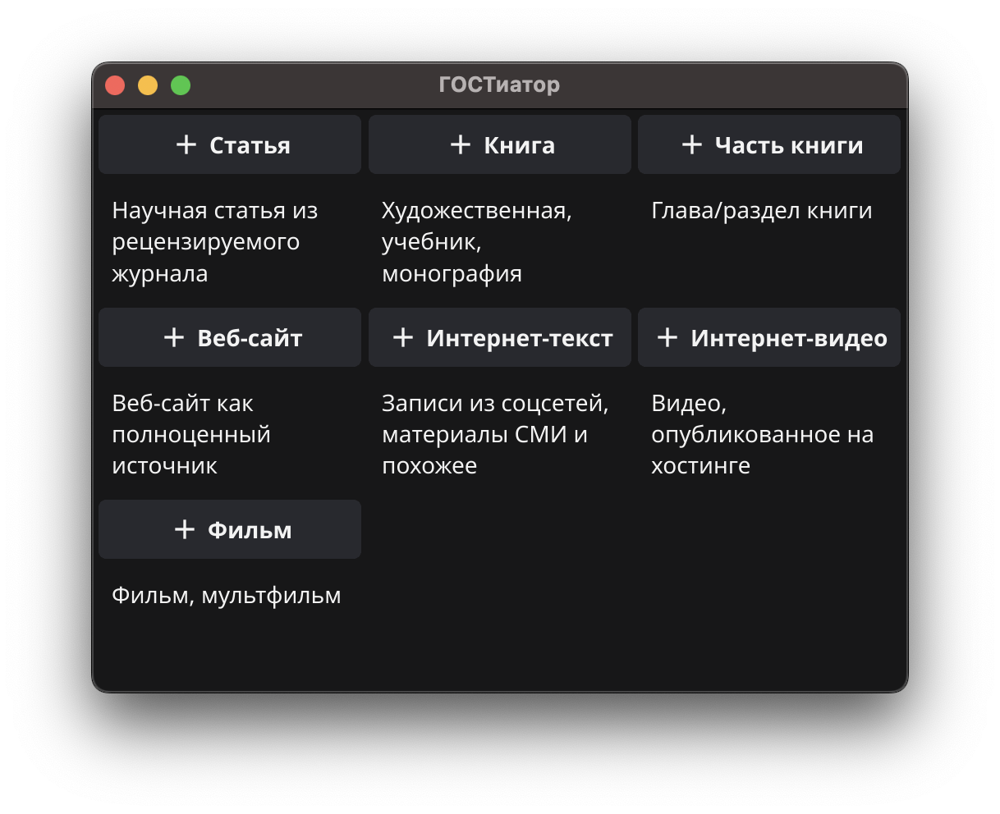
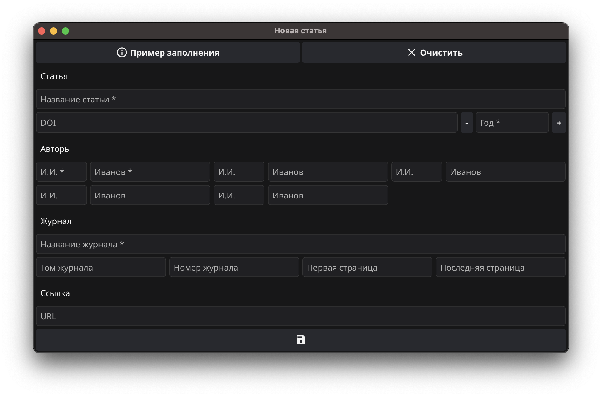
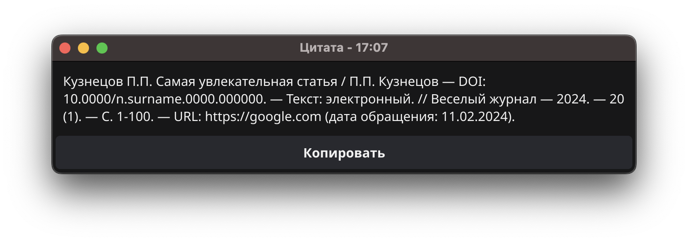
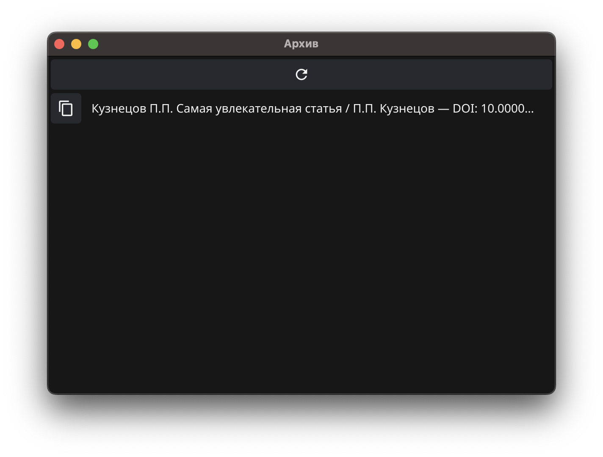

# ГОСТиатор

Оформление цитат по ГОСТ-2018 без смс и регистрации, просто продайте душу разработчику и подкиньте 
340 рублей на малиновый латте. Шутка. Не шутка то, что приложение реально поможет оформить ссылку на источник 
для академической работы в предельно близком к требованиями ГОСТ-2018 для библиографических источников формате. 

## Принцип работы

При запуске приложения открывается простое стартовое окно, где есть все поддерживаемые варианты источников, 
ссылку на которые можно сгенерировать с помощью приложения. 

### Создание цитаты

Кнопка `+ [тип источника]` создаёт новое окно. Это окно содержит форму, данные из которой затем будут использоваться 
для генерации ссылки на источник. Например, так выглядит форма для создания ссылки на научную статью: 

Обязательные поля в форме помечены *, факультативные — никак не отмечены. Рядом с полями, где ожидается число 
в качестве вводных данных, есть кнопки для изменения значения на +- 1 в допустимом диапазоне значения. В форме 
для ссылки на научную статью единственное число, которое ожидается, — это год публикации.

Кнопка `Пример заполнения` наполнит все поля водяными данными. 
Кнопка `Очистить` удалит информацию из всех полей без возможности восстановления. 

Наконец, `кнопка внизу` создаст ссылку на источник. Если цитата создана успешно, то окно с формой закроется,
появится новое окно с готовой цитатой и возможностью её скопировать с помощью кнопки `Копировать`. 

### Архив цитат 

Успешно созданные цитаты автоматически сохраняются, посмотреть их можно в архиве. Открыть его можно 
с помощью основного меню приложения: Архив –> Показать. 

Откроется новое окно, которое содержит все цитаты, которые когда-либо генерировались с этой установкой приложения. 
Если цитата создавалась, но её нет в архиве, нужно вручную обновить окно с помощью кнопки вверху. 

Каждую такую цитату можно скопировать с помощью кнопки рядом с цитатой. 
